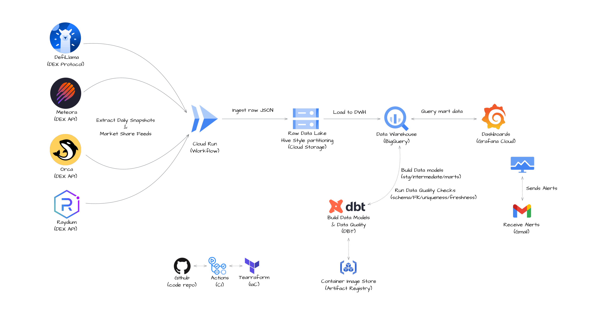
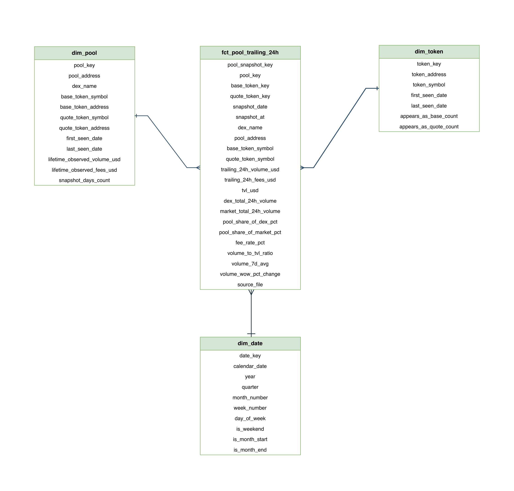
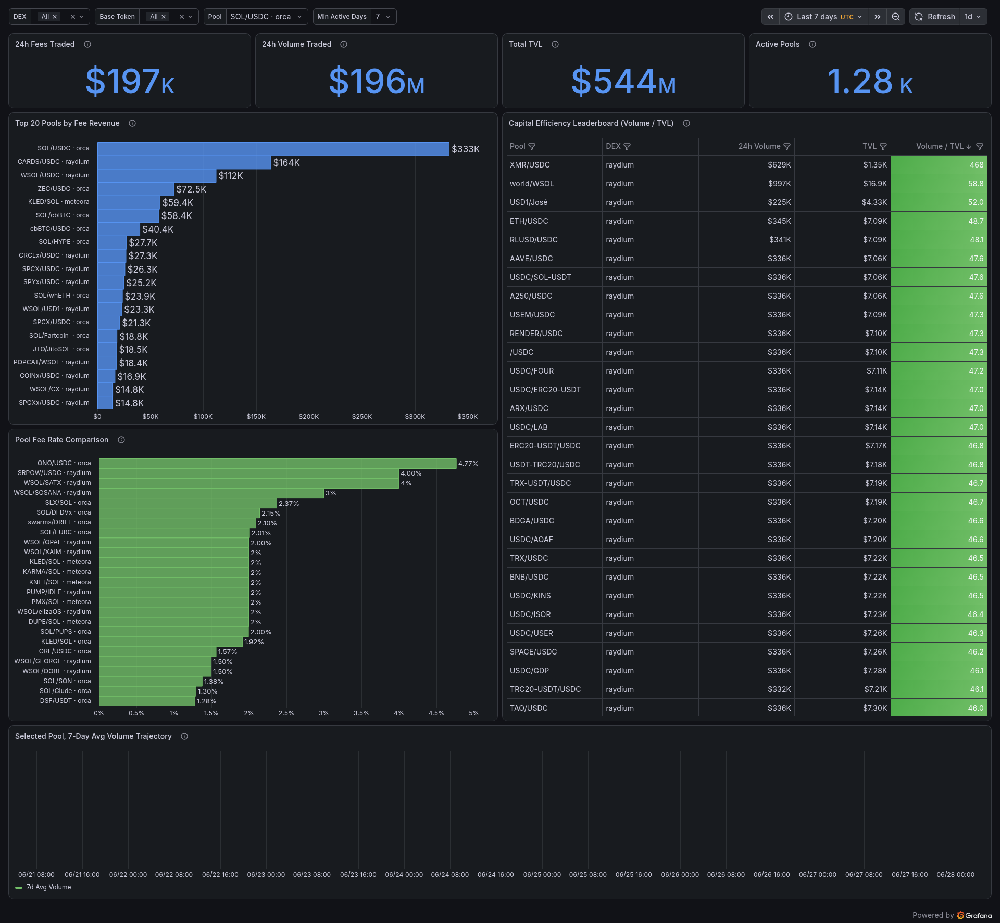
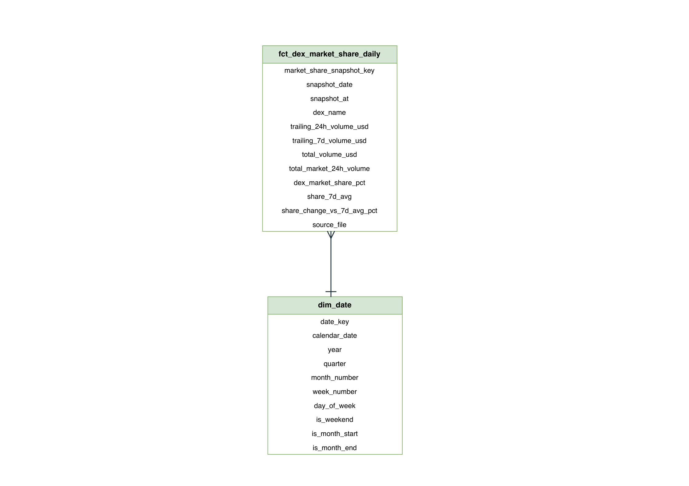
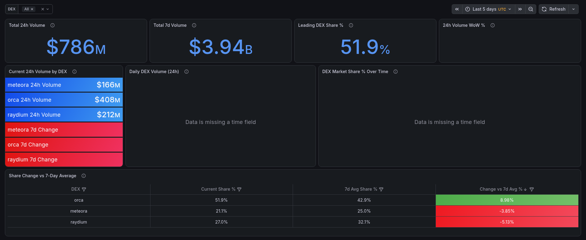
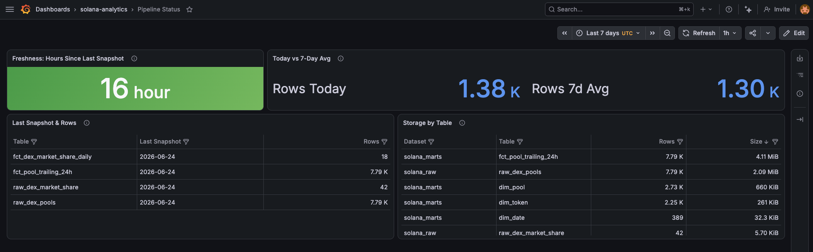

# Solana DEX Analytics Platform

A GCP data pipeline built on free, public Solana DEX APIs. It answers two questions about on chain activity from end to end: how liquidity providers earn across pools, and how the major DEXs split the market. Every day it pulls fresh data, drops the raw JSON into a GCS lake, loads it into BigQuery, shapes it into a Kimball model with dbt, and serves the results in Grafana.

> **This is a portfolio project. There are no wallets, funds, or private keys anywhere, just public, read only market data.**

---

## Architecture



It's a single container that does the whole job, kicked off on a fixed daily schedule:

```
02:00  Cloud Scheduler  →  solana-daily  (Cloud Run Job)
                           extract (4 APIs) → raw JSON to GCS
                           → load into BigQuery raw tables
                           → dbt build (staging → intermediate → marts + tests)

04:00  Cloud Scheduler  →  solana-freshness  (Cloud Run Job)
                           dbt source freshness: did yesterday's data actually land?
                           a safety net that catches a 02:00 run that never happened
```

Raw JSON lands in GCS (Hive partitioned) and is never touched again, so it stays the single source of truth:

```
gs://solana-dex-raw/raw/dex_pools/dex={raydium|orca|meteora}/date=YYYY-MM-DD/
gs://solana-dex-raw/raw/dex_market_share/date=YYYY-MM-DD/
```

Loads are idempotent: run the same day twice and it skips objects already in GCS and snapshots already in BigQuery, or with `--overwrite` it wipes that day's slice and reloads it cleanly. Each source stands on its own, so if one API is down the others still load and dbt still runs; the job then exits with an error code so you hear about it. dbt does every transform inside BigQuery and tests each model before it finishes.

---

## Business processes

### BP1: Liquidity Provider Visibility

Liquidity providers want to know where to put their money: which pools actually earn fees, which ones do the most trading on the least liquidity, and whether a pool is heating up or cooling off.

**Questions this answers:**
- Which pools bring in the most fee revenue?
- Which pools are the most efficient, doing the most volume per dollar of TVL?
- What fee rate does each established pool charge?
- How is a given pool's volume trending over time?

**How it works:** the three DEX APIs get normalized into one `raw_dex_pools` table. dbt then works out the per pool metrics (fee rate, volume to TVL ratio, 7 day average volume, week on week change) and builds the star schema:

- **`fct_pool_trailing_24h`**: one row per pool per snapshot (volume, fees, TVL, derived metrics)
- **`dim_pool`**: one row per pool (token pair, DEX, lifetime stats)
- **`dim_token`**: the token universe (role playing, as both base and quote)
- **`dim_date`**: the calendar dimension

**Data model**



**Dashboard**



---

### BP2: DEX Market Share

Protocol teams want to track their competitive position over time: who is winning volume, and how that balance is shifting.

**Questions this answers:**
- What share of total Solana DEX volume does each DEX hold?
- How is market share trending over time?
- Which DEX is gaining or losing ground against its own 7 day average?

**How it works:** DefiLlama returns rows at the protocol level (`raydium amm`, `meteora dlmm`, `orca dex`, and so on). dbt rolls these up to the three canonical DEXs (`raydium`, `orca`, `meteora`), sums their volume, then works out each DEX's market share and its 7 day trend:

- **`fct_dex_market_share_daily`**: one row per DEX per snapshot (volume, share %, 7 day average, share change)

**Data model**



**Dashboard**




---

## The data

Everything comes from free, public APIs that need no authentication:

| Source | Grain | Powers |
|---|---|---|
| [Raydium](https://api-v3.raydium.io) | pool level (volume, fees, TVL) | LP visibility |
| [Orca](https://api.orca.so) | pool level | LP visibility |
| [Meteora](https://amm-v2.meteora.ag) | pool level | LP visibility |
| [DefiLlama](https://api.llama.fi) | DEX level volume | market share |

The three DEX APIs each return a different JSON shape, so ingestion normalizes them into one common schema. DefiLlama feeds the market share side separately.

**A note on time:** the APIs hand back a rolling 24 hour snapshot, not arbitrary date queries. Each daily run stamps every row with `snapshot_at` (the exact UTC time of the call) and `snapshot_date` (the day that 24 hour window covers, which is yesterday). There's no historical backfill; the time series builds forward from day one. Mart columns use `trailing_24h_*` and `trailing_7d_*` names to make that explicit, never `daily_*`.

**A note on quality:** the DEX APIs are full of wash traded and spam pools (huge volume sitting on near zero TVL). Ingestion keeps only pools with **24h volume of at least $1,000 and TVL of at least $1,000**, which drops the noise.

---

## Stack

| Layer | Tool |
|---|---|
| Ingestion | Python 3.10 with httpx (tenacity retries), writes raw JSON to GCS |
| Raw load | BigQuery, idempotent load per snapshot (append, and delete the slice on overwrite) |
| Transform | dbt (staging, intermediate, marts) |
| Compute | Cloud Run Job |
| Scheduling | Cloud Scheduler (02:00 pipeline, 04:00 freshness) |
| Serving | Grafana, reading from `marts` through a service account that can only read |
| Monitoring | Cloud Logging metric and alert policy to email, plus a freshness safety net |
| Infrastructure | Terraform (GCS backend) |
| CI/CD | GitHub Actions with Workload Identity Federation, no key files |
| Package manager | uv |
| Region | `europe-west3` |

---

## Setup from scratch

**Prerequisites:** `gcloud` CLI, `terraform`, `docker`, `uv`

```bash
# 1. Authenticate to GCP (Application Default Credentials, no key file)
gcloud auth application-default login

# 2. Create the Artifact Registry repo first, since the Cloud Run jobs need an image to exist
cd terraform && terraform init
terraform apply -target=google_artifact_registry_repository.pipeline

# 3. Build and push the initial image
gcloud auth configure-docker europe-west3-docker.pkg.dev --quiet
IMAGE=europe-west3-docker.pkg.dev/<PROJECT_ID>/solana-pipeline/solana-pipeline
docker build --platform linux/amd64 -f docker/Dockerfile -t $IMAGE:latest .
docker push $IMAGE:latest

# 4. Provision everything else (GCS, BigQuery, SA + IAM, Cloud Run jobs, schedulers,
#    monitoring, WIF)
terraform apply

# 5. Seed the first day of data (extract, load, dbt), or just wait for 02:00 UTC
make run-image            # rebuilds the local image and runs the full pipeline
```

After that, every push to `main` is handled by CI. It builds and pushes the image, re-points both Cloud Run jobs at it, and applies any Terraform changes.

---

## dbt

```bash
cd dbt
dbt deps                                # install packages (dbt_utils)
dbt debug                               # verify the BigQuery connection
dbt build                               # run all models + tests
dbt docs generate && dbt docs serve     # browse lineage
```

| Layer | Schema | What it does |
|---|---|---|
| staging | `solana_staging` | one model per raw source: casts types, normalizes DEX names, rolls up DefiLlama protocols |
| intermediate | `solana_intermediate` | joins and derived metrics (fee rate, volume/TVL ratio, share %, 7 day averages) |
| marts | `solana_marts` | the Kimball star schemas, and the only layer Grafana reads from |

Data quality tests run on every `dbt build`: `not_null` and `accepted_values` on key columns, uniqueness on surrogate keys, source freshness, and a few singular tests that check each latest snapshot has all three DEXs and a sane row count. A failing test fails the build, the job exits with an error, and the alert fires.

> Note: the Cloud Run image uses dbt-core. A locally installed dbt Fusion preview can hard error on some deprecated YAML, so run dbt through the container (`make run-image`) if your local dbt misbehaves.

---

## Dashboards

Three Grafana dashboards live as JSON in `dashboards/`. Grafana only ever reads from the `solana_marts` schema (and the raw tables for the status board), through a service account that can only read.

### One time Grafana setup

```bash
# Create a key for the read only BigQuery reader SA (Terraform created the SA)
gcloud iam service-accounts keys create credentials-grafana.json \
  --iam-account "grafana-bigquery-reader@<PROJECT_ID>.iam.gserviceaccount.com"
```

In Grafana, go to **Connections → Add data source → Google BigQuery**:
- **Authentication:** Service Account, then paste `credentials-grafana.json`
- **Default project:** your project ID
- **Processing location:** `europe-west3` (required, queries fail without it)

### Import the dashboards

Go to **Dashboards → New → Import** and upload the JSON:

| File | Board | Shows |
|---|---|---|
| `dashboards/lp-visibility.json` | LP Visibility | top pools by fees, fee rate comparison, capital efficiency leaderboard, pool trajectory |
| `dashboards/market-share.json` | DEX Market Share | daily volume, share % over time, current volume per DEX, share change table |
| `dashboards/pipeline-status.json` | Pipeline Status | freshness indicator, last snapshot and rows per table, rows today vs 7 day average, storage |

### Pipeline Status (observability)

A health board you can read at a glance: freshness (hours since the last snapshot, colored green, yellow, or red), the latest snapshot date and row count per table, today's rows against the 7 day average, and storage per table.



---

## Monitoring

Everything funnels through one alert path. Any failure logs a structured `ERROR`, a Cloud Logging metric counts those errors from the Cloud Run jobs, and an alert policy emails `notification_email`.

| Mechanism | Catches |
|---|---|
| Log based error alert | a source or API failure, a dbt build or test failure, any uncaught error |
| Freshness job (04:00) | a 02:00 run that never happened (a Cloud Scheduler misfire or silent no show) |

In prod, logs come out as structured JSON (Cloud Logging severity plus `run_id` and `snapshot_date` on every line). To silence an alert that's firing, go to **Cloud Monitoring → Alerting → Incidents** and acknowledge it.

---

## Cost estimate

At portfolio scale (one daily run, a few thousand quality pools):

| Component | Est. monthly cost |
|---|---|
| Cloud Run Jobs (pipeline + freshness, daily) | ~$0.30 |
| BigQuery storage (raw + marts) | ~$0.50 |
| BigQuery query costs (loads + dbt) | ~$1.00 |
| Cloud Storage (GCS raw lake, 90 day lifecycle) | ~$0.30 |
| Cloud Scheduler + Monitoring | ~$0.20 |
| **Total** | **about $2 to $4 / month** |

---

## Repo structure

```
├── terraform/                  # all GCP infra as code
│   ├── main.tf                 # GCS bucket, BQ datasets, SA + IAM, Artifact Registry, WIF
│   ├── cloud_run.tf            # pipeline + freshness jobs, schedulers, shared env
│   ├── monitoring.tf           # log metric, email channel, alert policy
│   ├── grafana.tf              # the read only BigQuery reader SA
│   ├── cicd.tf                 # the Terraform deployer SA (for CI)
│   └── services.tf             # enabled GCP APIs
├── src/                        # flat module layout, no subpackages
│   ├── config.py               # pydantic settings
│   ├── logging.py              # structlog + Cloud Logging severity
│   ├── sources.py              # 4 API sources: fetch/parse + quality floor
│   ├── gcs.py                  # raw lake read/write + partition paths
│   ├── bigquery.py             # warehouse load helpers + schemas
│   ├── pipeline.py             # extract/load/transform stages + entrypoint
│   └── freshness.py            # dbt source freshness + alert on stale
├── dbt/
│   ├── models/
│   │   ├── staging/            # stg_dex_pools, stg_dex_market_share
│   │   ├── intermediate/       # int_pool_metrics, int_market_share_metrics
│   │   └── marts/              # fct_pool_trailing_24h, fct_dex_market_share_daily, dims
│   ├── tests/                  # singular SQL tests (completeness, row count, sanity)
│   └── dbt_project.yml
├── docker/Dockerfile           # multi stage build (app + dbt, uv)
├── dashboards/                 # Grafana dashboard JSON
├── static/                     # architecture diagram + dashboard screenshots
├── .github/workflows/
│   ├── push-pipeline-image.yml # build + push image, redeploy both jobs
│   └── deploy-terraform.yml    # plan on PRs, apply on merge to main
└── Makefile
```

---

## GitHub Actions secrets and variables

CI authenticates to GCP with Workload Identity Federation, so there are no service account key files. The Terraform workflow reads its inputs from repo Variables:

| Name | Type | Purpose |
|---|---|---|
| `GCP_PROJECT_ID` | Variable | GCP project ID |
| `GCP_REGION` | Variable | GCP region (`europe-west3`) |
| `ENVIRONMENT` | Variable | `prod` |
| `GH_REPO` | Variable | `owner/repo` (for the WIF binding) |
| `NOTIFICATION_EMAIL` | Variable | email for monitoring alerts |
